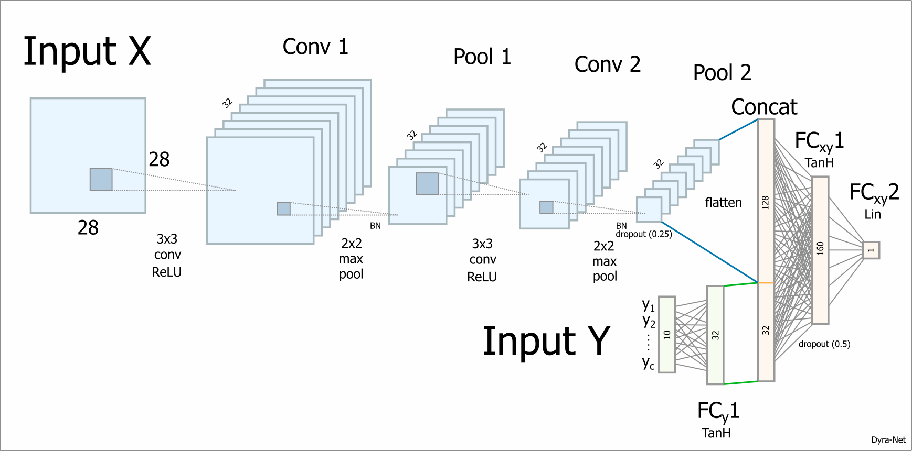

# Fashion-MNIST Image Classification using Dyra-Net
This is a proof-of-concept on solving the multi-class classification task using dyad ranking [1].
The test classification accuracy of the proposed model (Dyra-Net) is about 0.906 using the original training/test sets. All images were scaled to the unit interval.

## What is dyad ranking?
Dyad ranking is a supervised learning problem in which the training examples are rankings over tensor pairs.

To solve the multi-class image classification task with dyad ranking, a dyad (x,y) is considered to be
* an image (x) and
* a vector representation for a class label (y).


### Training information for classification
A multi-class training information is converted into (M-1) pairwise dyad rankings, where M denotes the number of classes, which is 10 in the case of Fashion-MNIST.

Example: An image x with the associated class label 2 would be expressed using one-hot vectors e_i as.
```
(x, e_2) > (x, e_1)
(x, e_2) > (x, e_3)
(x, e_2) > (x, e_4)
...
(x, e_2) > (x, e_10)
```

## Dyra-Net Architecture

The input of Dyra-Net consists of an image class-vector pair (x,y).
For more information about the model and the implementation see `code`.

### Visualization
The scores produced by the dyad ranking model can be used for a visualization called ```dyadic multidimensional unfolding```.


## Cite
If you like the idea, or build upon it, please cite the paper [1]. You an also contact me, if you have questions, comments or if you are interested in some kind of collaboration.

[1] Dyad ranking using Plackett–Luce models based on joint feature representations, D. Schäfer & E. Hüllermeier, 2018